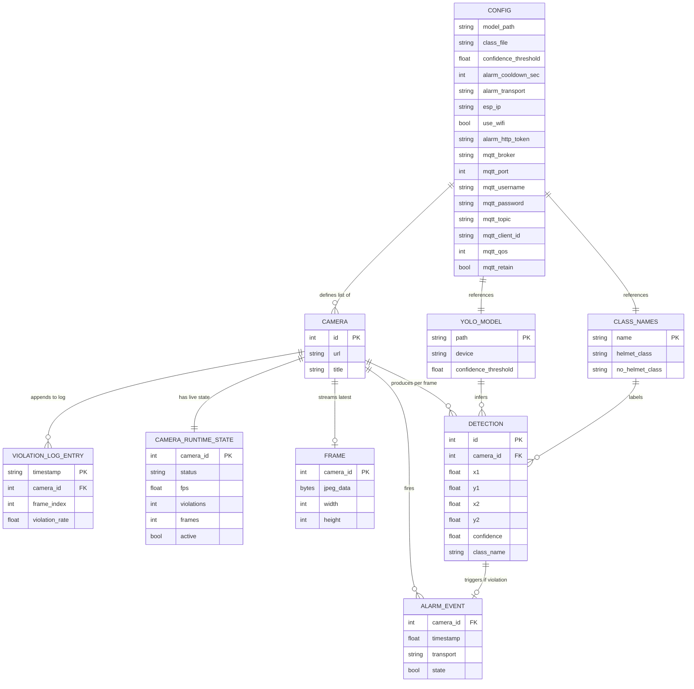

# Axis CCTV — Class Diagram & ERD

> Diagrams use [Mermaid](https://mermaid.js.org/) syntax — rendered natively in GitHub, GitLab, and most modern IDEs.

---

## Class Diagram

Covers all Python backend modules and React frontend components, and the relationships between them.

```mermaid
classDiagram
    %% ================================================================
    %% BACKEND — Services
    %% ================================================================

    class CameraManager {
        <<service / singleton>>
        +dict~int,bytes~  frame_dict
        +dict~int,dict~   stats_dict
        +Lock             lock
        +dict~int,Thread~ threads
        +dict~int,Event~  stop_events
        +YOLO             model
        +str              helmet_class
        +str              no_helmet_class
        +bool             _running
        ──────────────────────────────
        +initialize()
        +shutdown()
        +start_all()
        +stop_all()
        +start_camera(cam_id: int)
        +stop_camera(cam_id: int)
        -_start_camera(cam_id, url, ...)
        +get_latest_frame(cam_id) bytes
        +get_stats() dict
        +get_camera_statuses() list
        +is_running() bool
    }

    %% ================================================================
    %% BACKEND — Modules (functional, no class)
    %% ================================================================

    class detector {
        <<module>>
        +load_model(model_path) YOLO
        +load_class_names(path) tuple
        +run_detection(model, frame, conf) list
    }

    class camera_worker {
        <<module>>
        +camera_loop(cam_id, url, model, ...)
        +log_violation(cam_id, frame_idx, rate)
        +ensure_dir(path)
    }

    class alarm {
        <<module>>
        +str    SERIAL_PORT
        +int    BAUDRATE
        +Serial ser
        +dict   last_sent_time
        ──────────────────────────────
        +init_serial()
        +close_serial()
        +set_serial_port(port)
        +reconnect_serial()
        +trigger_alarm(camera_id, cooldown, ...)
        +send_buzzer_command(state, ...)
        -_send_usb(state)
        -_send_http(state, esp_ip, token)
        -_send_mqtt(state, broker, port, ...)
    }

    class config_module {
        <<module>>
        +CONFIG_PATH: Path
        ──────────────────────────────
        +load_config() dict
        +save_config(data: dict)
        +get_config() dict
    }

    %% ================================================================
    %% BACKEND — FastAPI App & Routers
    %% ================================================================

    class FastAPIApp {
        <<FastAPI>>
        +lifespan(app)
        +CORSMiddleware
        ──────────────────────────────
        +include_router(cameras)
        +include_router(config_routes)
        +include_router(alarm_routes)
        +include_router(logs)
        +include_router(stream)
        +mount("/", StaticFiles)
    }

    class cameras_router {
        <<APIRouter  /api/cameras>>
        +list_cameras() GET /
        +add_camera() POST /
        +update_camera(id) PUT /{id}
        +delete_camera(id) DELETE /{id}
        +start_all() POST /start
        +stop_all() POST /stop
        +start_camera(id) POST /{id}/start
        +stop_camera(id) POST /{id}/stop
    }

    class config_router {
        <<APIRouter  /api/config>>
        +get_full_config() GET /
        +update_config() PATCH /
    }

    class alarm_router {
        <<APIRouter  /api/alarm>>
        +test_alarm() POST /test
        +alarm_status() GET /status
    }

    class logs_router {
        <<APIRouter  /api/logs>>
        +get_logs(lines) GET /
        +clear_logs() DELETE /
    }

    class stream_router {
        <<APIRouter  /api/stream>>
        +stream_camera(cam_id) GET /{cam_id}
        +stream_status() GET /status/all
    }

    %% ================================================================
    %% BACKEND — Pydantic Models
    %% ================================================================

    class CameraUpdate {
        <<Pydantic BaseModel>>
        +str            url
        +Optional~str~  title
    }

    class ConfigUpdate {
        <<Pydantic BaseModel>>
        +Optional~List~  camera_feeds
        +Optional~List~  camera_titles
        +Optional~str~   model_path
        +Optional~float~ confidence_threshold
        +Optional~int~   alarm_cooldown_sec
        +Optional~str~   alarm_transport
        +Optional~str~   esp_ip
        +Optional~bool~  use_wifi
        +Optional~str~   alarm_http_token
        +Optional~str~   mqtt_broker
        +Optional~int~   mqtt_port
        +Optional~str~   mqtt_username
        +Optional~str~   mqtt_password
        +Optional~str~   mqtt_topic
        +Optional~str~   mqtt_client_id
        +Optional~int~   mqtt_qos
        +Optional~bool~  mqtt_retain
    }

    %% ================================================================
    %% FRONTEND — React Components
    %% ================================================================

    class App {
        <<React Component>>
        +cameras: Camera[]
        +running: bool
        +tab: string
        +toast: object
        ──────────────────────────────
        +fetchCameras()
        +handleStartStop()
    }

    class LiveView {
        <<React Component>>
        +cameras: Camera[]
        +running: bool
    }

    class CameraCard {
        <<React Component>>
        +camera: Camera
        +running: bool
        +imgError: bool
    }

    class ConfigPanel {
        <<React Component>>
        +cfg: object
        +saving: bool
        ──────────────────────────────
        +save()
        +addCamera()
        +removeCamera(i)
    }

    class LogsPanel {
        <<React Component>>
        +logs: string[]
        +autoRefresh: bool
        ──────────────────────────────
        +fetchLogs()
        +clearLogs()
    }

    class AlarmPanel {
        <<React Component>>
        +status: object
        +testing: bool
        ──────────────────────────────
        +testAlarm()
    }

    class ApiClient {
        <<module  api/client.js>>
        +getCameras()
        +addCamera(url, title)
        +updateCamera(id, url, title)
        +deleteCamera(id)
        +startAll()
        +stopAll()
        +getConfig()
        +updateConfig(data)
        +testAlarm()
        +getAlarmStatus()
        +getLogs(lines)
        +clearLogs()
        +streamUrl(camId) string
    }

    %% ================================================================
    %% RELATIONSHIPS
    %% ================================================================

    %% App startup / shutdown
    FastAPIApp --> CameraManager         : lifespan initialize/shutdown

    %% Routers → Manager / Config
    FastAPIApp "1" *-- "5" cameras_router   : mounts
    FastAPIApp "1" *-- "1" config_router    : mounts
    FastAPIApp "1" *-- "1" alarm_router     : mounts
    FastAPIApp "1" *-- "1" logs_router      : mounts
    FastAPIApp "1" *-- "1" stream_router    : mounts

    cameras_router --> CameraManager     : start/stop/status
    cameras_router --> config_module     : read/write config.yaml
    cameras_router ..> CameraUpdate      : request body

    config_router  --> config_module     : read/write config.yaml
    config_router  ..> ConfigUpdate      : request body

    alarm_router   --> alarm             : send_buzzer_command()
    alarm_router   --> config_module     : read alarm settings

    logs_router    --> config_module     : uses LOG_PATH constant

    stream_router  --> CameraManager     : get_latest_frame()

    %% Manager → worker modules
    CameraManager --> camera_worker      : spawns threads
    CameraManager --> detector           : preloads model
    CameraManager --> alarm              : init_serial / close_serial
    CameraManager --> config_module      : get_config()

    %% Worker dependencies
    camera_worker --> detector           : run_detection()
    camera_worker --> alarm              : trigger_alarm()

    %% Frontend component tree
    App "1" *-- "1" LiveView             : renders
    App "1" *-- "1" ConfigPanel          : renders
    App "1" *-- "1" LogsPanel            : renders
    App "1" *-- "1" AlarmPanel           : renders
    LiveView "1" *-- "0..*" CameraCard   : renders per camera

    %% All components use API client
    App        --> ApiClient             : startAll / stopAll / getCameras
    ConfigPanel --> ApiClient            : getConfig / updateConfig
    LogsPanel   --> ApiClient            : getLogs / clearLogs
    AlarmPanel  --> ApiClient            : testAlarm / getAlarmStatus
    CameraCard  --> ApiClient            : streamUrl (img src)
```

---

## Entity Relationship Diagram

The app has no SQL database — data is persisted in `config.yaml` and `logs/alerts.log`. The ERD models all logical data entities (persisted and in-memory) and their relationships.



---

## Data Flow Summary

```
config.yaml ──► CONFIG ──► CAMERA list
                                │
                    ┌───────────┼───────────────┐
                    ▼           ▼               ▼
                 YOLO_MODEL  CLASS_NAMES    ALARM settings
                    │           │
                    └─────┬─────┘
                          ▼
              RTSP stream ──► FRAME ──► DETECTION
                                            │
                              violation? ───┼──► ALARM_EVENT ──► USB / HTTP / MQTT
                                            │
                                            └──► VIOLATION_LOG_ENTRY ──► alerts.log
                                            │
                                            └──► CAMERA_RUNTIME_STATE ──► /api/stream
                                                                          /api/cameras
```
